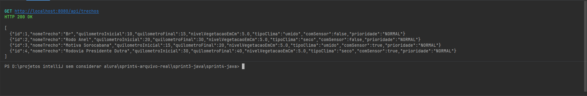
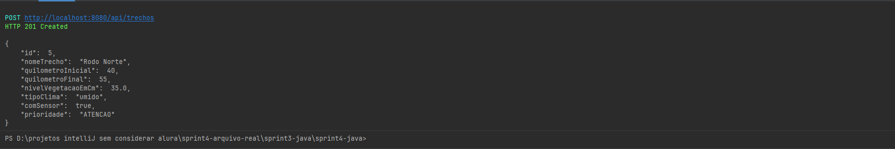
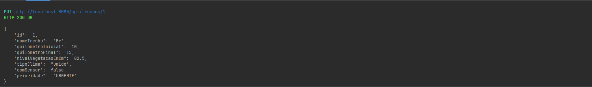
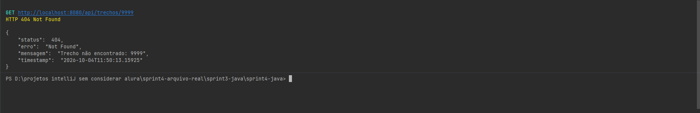
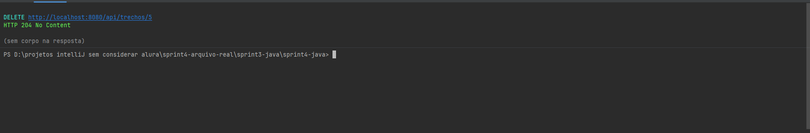
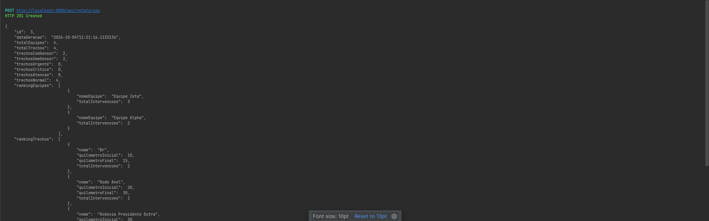
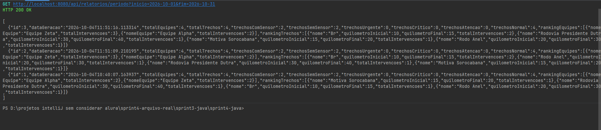
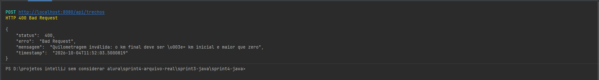

# MOTIVA — Sprint 4: Spring Boot + JPA + API REST

API REST que controla o crescimento de vegetação em trechos de rodovia, aciona equipes de manutenção,
registra intervenções e gera relatórios de prioridade. É a evolução da Sprint 3 (console + JDBC puro):
o sistema continua usando o **Oracle FIAP** e as **mesmas tabelas e colunas**, mas agora com
**Spring Boot + Spring Data JPA**.

## Tecnologias
Java 17 · Spring Boot 4.1.x · Spring Web · Spring Data JPA (Hibernate) · Bean Validation · Oracle (`ojdbc17` via Maven) · JUnit 5 + Mockito + MockMvc

## Arquitetura (Controller → Service → Repository → Banco)

```
src/main/java/br/com/motiva/
├── MotivaApplication.java     # @SpringBootApplication (main)
├── model/                     # @Entity: TrechoRodovia, EquipeManutencao, IntervencaoOperacional,
│                              #          RelatorioPrioridade, RankingEquipe, RankingTrecho (+ enum NivelPrioridade)
├── repository/                # interfaces JpaRepository: sem SQL manual, com derived queries
├── service/                   # @Service: validações da Sprint 1 + motor de prioridade + motor de intervenções
├── controller/                # @RestController: endpoints REST
├── dto/                       # contrato da API (Request/Response), separado da entidade
├── exception/                 # @RestControllerAdvice: tratamento global de erros (404/400)
├── factory/                   # IntervencaoFactory (@Component): padrão Factory da Aula 14
└── servico/                   # classe abstrata ServicoIntervencao + RocadaMecanizada/Pulverizacao (polimorfismo da Sprint 2)
```

| Sprint 3 (JDBC puro) | Sprint 4 (Spring Boot) |
|---|---|
| `TrechoRodoviaDAO`, `EquipeManutencaoDAO`, ... (centenas de linhas) | `TrechoRepository`, `EquipeRepository`, ... (interfaces de poucas linhas) |
| `ConexaoBanco` (Singleton) | `application.properties` + pool de conexões do Spring |
| `AvaliacaoTrechos`, `Relatorio` | `IntervencaoService`, `RelatorioService` (`@Service`, injeção por construtor) |
| `Main` com `System.out.println` | `@RestController` + JSON |

## Como executar

1. **Banco:** no Oracle SQL Developer rode (F5 / *Run Script*), nesta ordem:
   1. `scripts/01-criar-tabelas.sql` — recria as tabelas da Sprint 3 (mesmos nomes) e cria as **sequences**. Os `DROP` podem dar erro na primeira vez; é normal. **Apaga os dados.**
      *Alternativa que reaproveita as tabelas e os dados da Sprint 3:* `scripts/01-alternativo-migrar-sprint3.sql` (remove o `IDENTITY`, cria as sequences a partir do maior id, adiciona as colunas novas e as FKs). Use um **ou** outro.
      O script alternativo não foi executado contra o Oracle da FIAP: faça backup/export das tabelas antes. A consulta de
      conferência perto do fim do script (`... WHERE trechoId IS NULL OR equipeId IS NULL`) **precisa voltar vazia** antes de
      criar as chaves estrangeiras; se listar linhas, corrija ou apague essas intervenções (o trecho ou a equipe delas não existe mais).
   2. `scripts/02-dados.sql` — massa de dados de teste.
2. **Credenciais:** abra `src/main/resources/application.properties` e troque `SEU_RM` e `SUA_SENHA` pelo seu RM e pela senha do Oracle da FIAP. **Não comite os valores reais:** o repositório guarda só os placeholders `SEU_RM` e `SUA_SENHA`, então confira com `git diff src/main/resources/application.properties` antes de cada commit.
3. **Subir a API:** `mvn spring-boot:run` (ou *Run* na classe `MotivaApplication` pela IDE) → http://localhost:8080
4. **Testes:** `mvn test` (não precisam de Oracle nem sobem o Spring).

## Endpoints

### Trechos — `/api/trechos`
| Método | Rota | Ação | Sucesso / Erro |
|---|---|---|---|
| GET | `/api/trechos` | Listar todos (com a prioridade calculada) | 200 |
| GET | `/api/trechos/{id}` | Buscar por ID | 200 / 404 |
| GET | `/api/trechos/vegetacao?minimo=30` | Derived query: vegetação ≥ mínimo | 200 |
| GET | `/api/trechos/clima/{clima}` | Derived query: por clima (`umido`/`seco`) | 200 |
| POST | `/api/trechos` | Criar (header `Location` aponta para o novo recurso) | 201 / 400 |
| POST | `/api/trechos/simular-crescimento` | Ação: faz a grama crescer em todos os trechos | 200 |
| PUT | `/api/trechos/{id}` | Atualizar | 200 / 400 / 404 |
| DELETE | `/api/trechos/{id}` | Remover (400 se o trecho já tem intervenções) | 204 / 400 / 404 |

### Equipes — `/api/equipes`
| Método | Rota | Ação | Sucesso / Erro |
|---|---|---|---|
| GET | `/api/equipes` | Listar todas | 200 |
| GET | `/api/equipes/{id}` | Buscar por ID | 200 / 404 |
| GET | `/api/equipes/rocada/{tipo}` | Derived query: `manual` ou `mecanizada` | 200 |
| POST | `/api/equipes` | Criar (com `Location`) | 201 / 400 |
| PUT | `/api/equipes/{id}` | Atualizar | 200 / 400 / 404 |
| DELETE | `/api/equipes/{id}` | Remover (400 se a equipe já tem intervenções) | 204 / 400 / 404 |

### Intervenções — `/api/intervencoes`
| Método | Rota | Ação | Sucesso / Erro |
|---|---|---|---|
| GET | `/api/intervencoes` | Listar histórico | 200 |
| GET | `/api/intervencoes/{id}` | Buscar por ID | 200 / 404 |
| GET | `/api/intervencoes/equipe/{nome}` | Por nome da equipe | 200 |
| POST | `/api/intervencoes` | Criar (`trechoId` + `equipeId`), com `Location` | 201 / 400 / 404 |
| POST | `/api/intervencoes/gerar` | Ação: motor da Sprint 3, gera para trechos ≥ 30 cm | 200 |
| PUT | `/api/intervencoes/{id}` | Trocar trecho/equipe (ver regra abaixo) | 200 / 400 / 404 |
| DELETE | `/api/intervencoes/{id}` | Remover | 204 / 404 |

### Relatórios — `/api/relatorios`
| Método | Rota | Ação | Sucesso / Erro |
|---|---|---|---|
| POST | `/api/relatorios` | Gera o relatório com os trechos atuais e **persiste** no histórico (com `Location`) | 201 |
| GET | `/api/relatorios` | Lista o histórico | 200 |
| GET | `/api/relatorios/periodo?inicio=2026-09-01&fim=2026-09-30` | Consulta por período (datas `AAAA-MM-DD`) | 200 / 400 |
| GET | `/api/relatorios/{id}` | Busca um relatório | 200 / 404 |

### Regras de negócio (todas no Service)
- **Motor de prioridade** (`MotorPrioridadeService`): `URGENTE` ≥ 80 cm · `CRITICO` ≥ 50 cm · `ATENCAO` ≥ 25 cm · `NORMAL` < 25 cm.
- **Motor de intervenções**: trechos com vegetação ≥ 30 cm (regra da Sprint 3). Clima **úmido** → `RocadaMecanizada` (equipe `mecanizada`); clima **seco** → `Pulverizacao` (equipe `manual`). Depois do serviço o trecho volta a 5 cm.
- **Validações da Sprint 1**: nome obrigatório, clima `umido`/`seco`, `kmFinal >= kmInicial`, `nivelVegetacao >= 0`.
- **PUT de intervenção:** se só a equipe muda, atualiza a equipe (conferindo a compatibilidade) e mantém data e vegetação. Se o **trecho** muda, o novo trecho é cortado (volta a 5 cm), a altura anterior ao corte do trecho antigo é restaurada (somente se ele ainda estiver em 5 cm, para não apagar crescimento posterior) e a `dataGeracao` é renovada. A altura anterior ao corte fica na coluna `nivelVegetacaoAntesCm`.
- **Erros** sempre no mesmo formato JSON: `{"status":404,"erro":"Not Found","mensagem":"...","timestamp":"..."}`. Além de 400/404, o `GlobalExceptionHandler` converte `DataIntegrityViolationException` (o banco recusou por FK/UNIQUE) em **400** e qualquer erro inesperado em **500**, sem expor stack trace nem mensagens `ORA-` (checklist da Aula 13: 404, 400, 500).

## Exemplos cURL
> No Windows PowerShell use `curl.exe` (o `curl` puro é um alias do PowerShell) e troque as aspas do JSON por `\"`, ou use o Postman.

```bash
# 1. Listar trechos (200)
curl http://localhost:8080/api/trechos

# 2. Criar trecho (201)
curl -X POST http://localhost:8080/api/trechos -H "Content-Type: application/json" \
  -d '{"nomeTrecho":"Rodo Norte","quilometroInicial":40,"quilometroFinal":55,"nivelVegetacaoEmCm":35.0,"tipoClima":"umido","comSensor":true}'

# 3. Buscar inexistente (404)
curl -i http://localhost:8080/api/trechos/9999

# 4. Atualizar (200)
curl -X PUT http://localhost:8080/api/trechos/1 -H "Content-Type: application/json" \
  -d '{"nomeTrecho":"Br","quilometroInicial":10,"quilometroFinal":15,"nivelVegetacaoEmCm":82.5,"tipoClima":"umido","comSensor":false}'

# 5. Dados inválidos: km final menor que o inicial (400)
curl -i -X POST http://localhost:8080/api/trechos -H "Content-Type: application/json" \
  -d '{"nomeTrecho":"X","quilometroInicial":30,"quilometroFinal":10,"nivelVegetacaoEmCm":5,"tipoClima":"seco"}'

# 6. Deletar (204)
curl -i -X DELETE http://localhost:8080/api/trechos/5

# 7. Derived query: trechos com pelo menos 30 cm
curl "http://localhost:8080/api/trechos/vegetacao?minimo=30"

# 8. Criar equipe (201)
curl -X POST http://localhost:8080/api/equipes -H "Content-Type: application/json" \
  -d '{"nomeEquipe":"Equipe Alfa","numeroFuncionarios":6,"tipoDeRocadaDeAtuacao":"mecanizada"}'

# 9. Motor: gerar intervenções (200)
curl -X POST http://localhost:8080/api/intervencoes/gerar

# 10. Intervenção com equipe incompatível (400): trecho úmido exige equipe mecanizada
curl -i -X POST http://localhost:8080/api/intervencoes -H "Content-Type: application/json" \
  -d '{"trechoId":1,"equipeId":1}'

# 11. Gerar relatório (201), histórico (200) e consulta por período (200)
curl -X POST http://localhost:8080/api/relatorios
curl http://localhost:8080/api/relatorios
curl "http://localhost:8080/api/relatorios/periodo?inicio=2026-09-01&fim=2026-12-31"
```

## Evidências (prints das requisições)

Prints tirados no PowerShell com a API rodando contra o Oracle da FIAP. Cada um mostra o método, a URL e o status HTTP; os arquivos ficam em `docs/prints/`.

| # | Requisição | Resultado | Print |
|---|---|---|---|
| 1 | `GET /api/trechos` | 200 | [`docs/prints/01-get-trechos.png`](docs/prints/01-get-trechos.png) |
| 2 | `POST /api/trechos` | 201 | [`docs/prints/02-post-trecho.png`](docs/prints/02-post-trecho.png) |
| 3 | `PUT /api/trechos/1` | 200 | [`docs/prints/03-put-trecho.png`](docs/prints/03-put-trecho.png) |
| 4 | `GET /api/trechos/9999` | 404 | [`docs/prints/04-get-404.png`](docs/prints/04-get-404.png) |
| 5 | `DELETE /api/trechos/5` | 204 | [`docs/prints/05-delete-trecho.png`](docs/prints/05-delete-trecho.png) |
| 6 | `POST /api/relatorios` | 201 | [`docs/prints/06-post-relatorio.png`](docs/prints/06-post-relatorio.png) |
| 7 | `GET /api/relatorios/periodo?inicio=2026-10-01&fim=2026-10-31` | 200 | [`docs/prints/07-relatorio-periodo.png`](docs/prints/07-relatorio-periodo.png) |
| 8 | `POST /api/trechos (km final menor que o inicial)` | 400 | [`docs/prints/08-post-400.png`](docs/prints/08-post-400.png) |

### 1 · GET /api/trechos — 200 OK



### 2 · POST /api/trechos — 201 Created



### 3 · PUT /api/trechos/1 — 200 OK



### 4 · GET /api/trechos/9999 — 404 Not Found



### 5 · DELETE /api/trechos/5 — 204 No Content



### 6 · POST /api/relatorios — 201 Created



### 7 · GET /api/relatorios/periodo?inicio=2026-10-01&fim=2026-10-31 — 200 OK



### 8 · POST /api/trechos (km final menor que o inicial) — 400 Bad Request



## Conceitos em Foco (respostas)

**1. Por que o Repository é uma interface e não uma classe? Quem escreve a implementação e quando?**
Porque nós só declaramos *o que* queremos (o contrato: `save`, `findById`, `findByTipoClima...`) e não *como* fazer.
Quem escreve a implementação é o Spring Data, em tempo de execução: quando a aplicação sobe, ele lê a interface,
o tipo da entidade e o nome dos métodos, e cria um objeto que implementa tudo isso. Esse objeto é injetado
no construtor do Service (ou com `@Autowired`) onde precisamos dele. Ninguém precisa escrever `PreparedStatement`, `ResultSet` ou fechar conexão.

**2. O pattern DAO da Sprint 3 "morreu" na migração ou só mudou de forma?**
Só mudou de forma. A responsabilidade continua a mesma: isolar o acesso ao banco do resto do sistema.
O `Repository` do Spring Data **é** um DAO, só que gerado pelo framework. O que sumiu foi o trabalho braçal:
o SQL escrito à mão, o mapeamento linha → objeto, o `try/finally` para fechar recursos e a classe `ConexaoBanco`
(agora o Spring gerencia a conexão pelo `application.properties`).

**3. Por que a validação de `nivelVegetacao >= 0` (Sprint 1) deve ficar no Service e não no Controller?**
Porque o Controller é só uma porta de entrada (HTTP). A regra de negócio precisa valer sempre, não importa quem
chame: outro Service, um teste, uma tarefa agendada. Se ficasse no Controller, qualquer outro caminho
poderia gravar um valor inválido. No Service a regra fica em um lugar só, e dá para testá-la com JUnit + Mockito
sem subir o Spring nem o Oracle (Aula 15: `assertThrows` + `verifyNoInteractions(repository)`).

**4. No JDBC puro vocês escreviam SQL. Onde está o SQL do `findByTipo()`? Quem o gerou?**
Não existe SQL escrito por nós. Na inicialização o Spring Data lê o nome do método, separa
`find` + `By` + propriedade + condição (`GreaterThanEqual`, `IgnoreCase`...) e monta a consulta sobre a entidade;
o Hibernate traduz para o SQL do Oracle. Por exemplo, `findByTipoClimaIgnoreCase` vira algo como
`select ... from trechos where lower(tipoClima)=lower(?)`. Dá para ver o SQL gerado no console
porque `spring.jpa.show-sql=true` está ligado.

## Decisões técnicas
- **Sequences e tabelas da Sprint 3:** cada `@Entity` usa `@GeneratedValue` + `@SequenceGenerator` (`allocationSize = 1`, igual ao `INCREMENT BY 1`) ligado a uma sequence (`seq_trechos`, `seq_equipes`...). Na Sprint 3 o `id` era `GENERATED ALWAYS AS IDENTITY`, que não aceita o id vindo da sequence. Há dois caminhos, ambos mantendo nomes de tabelas e colunas: `01-criar-tabelas.sql` (recria, apaga os dados) e `01-alternativo-migrar-sprint3.sql` (**reaproveita** as tabelas e os dados: `DROP IDENTITY`, sequences começando depois do maior id, colunas novas e FKs).
- **Colunas novas:** `relatoriosPrioridade` ganhou 4 colunas (`trechosUrgente`, `trechosCritico`, `trechosAtencao`, `trechosNormal`) para guardar o resultado do motor de prioridade no histórico.
- **Sem `@ManyToOne` (decisão consciente):** `IntervencaoOperacional` guarda `trechoId`/`equipeId` e os rankings guardam `relatorioId` como `Long`, mapeados com `@Column`, como na Aula 13 ("sem mapeamento de relacionamento, modelo simples"). A integridade é garantida pelas `FOREIGN KEY` do banco e pelas validações do Service (o `DELETE` de trecho/equipe com intervenções devolve 400 em vez de `ORA-02292`; se algo escapar, o handler converte `DataIntegrityViolationException` em 400). O custo: o modelo de objetos não navega entre as entidades.
- **N+1 no histórico de relatórios:** em vez de 2 consultas de ranking por relatório, `RelatorioService.montarRespostas` busca os rankings de todos os relatórios de uma vez com uma *derived query* (`findByRelatorioIdInOrderByTotalIntervencoesDesc`) e separa por `relatorioId` em memória: 2 consultas de ranking no total, qualquer que seja o número de relatórios.
- **PUT de intervenção coerente:** `atualizar` compara o trecho novo com o `trechoId` gravado. Se o trecho mudou: corta o novo, restaura a altura do antigo (coluna `nivelVegetacaoAntesCm`, só se ele ainda estiver em 5 cm) e renova `dataGeracao`. Se só a equipe mudou, nada disso acontece.
- **Naming:** `PhysicalNamingStrategyStandardImpl` mantém as colunas camelCase da Sprint 3 (`quilometroInicial`).
- **`ddl-auto=none`:** o Hibernate nunca altera o schema; quem cria as tabelas é o script.
- **Padrões das aulas:** `ResponseEntity`, Service/Repository/Controller (Aula 13); Factory como `@Component` e beans singleton (Aula 14); JUnit 5 + Mockito + AAA (Aula 15).
- **`@Transactional`:** em `IntervencaoService.criar()`, `atualizar()` e `gerarIntervencoes()` (INSERT da intervenção + UPDATE do trecho: tudo ou nada) e em `RelatorioService.gerar()` (relatório + rankings). É o equivalente ao commit/rollback manual da Sprint 3.
- **Injeção por construtor:** Controllers e Services recebem as dependências por construtor com campos `final` (a Aula 14 cita "`@Autowired` ou injeção via construtor"). Nos testes o `@InjectMocks` continua funcionando do mesmo jeito.
- **`Location` no 201:** `ResponseEntity.created(URI.create("/api/trechos/" + id))`.
- **Rotas de ação:** `/simular-crescimento` e `/gerar` são `POST` em sub-rota porque não criam um recurso nem são idempotentes (cada chamada altera o estado de novo); por isso não cabem em `PUT`/`DELETE` nem em `GET`.
- **Bônus:** DTOs (a entidade nunca é exposta), Bean Validation (`@Valid`, `@NotNull`, `@NotBlank` e `@Positive` nos ids e no número de funcionários; as regras de negócio continuam no Service), `@RestControllerAdvice` e testes de API com `MockMvc` em modo *standalone* (só Controller + handler, Service falso). Não usamos `@SpringBootTest`: a Aula 15 o classifica como teste de integração (sobe tudo e conecta no Oracle).

## Boas práticas Git
Commits pequenos e incrementais, um por etapa, no padrão Conventional Commits (`feat:`, `fix:`, `test:`, `docs:`, `chore:`). O histórico real está na aba *Commits* do repositório no GitHub.

O `.gitignore` cobre `target/`, `.idea/`, `*.iml` e arquivos de credencial locais. **Nenhuma credencial real é versionada:** o `application.properties` guarda apenas os placeholders `SEU_RM` e `SUA_SENHA`, que cada integrante troca localmente pelos próprios dados e não comita.

## Integrantes
| RM | Nome |
|---|---|
| 563415 | Fernando Caires Silva |
| 563567 | Raphael Mischiatti de Souza |
| 563500 | Guilherme Martins Rezende |
| 565434 | Giovanna Fernandes Pereira |
| 565323 | João Pedro de Moura Albino |
| 561675 | Kauê Silva Matheus |
